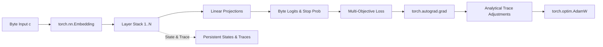

# Requirements

### Overview & Goals
Porting the Test-Model-Thing (TMT) recurrent byte-level language model from Apple MLX to PyTorch maximizes practical utility, computational throughput, and broad accessibility. While MLX restricts execution to Apple Silicon hardware, PyTorch empowers researchers and practitioners across all major computing environments (NVIDIA CUDA, AMD ROCm, Apple MPS, and standard CPUs), maximizing the aggregate value and collective adoption of the architecture.

### Scope
- **In Scope**:
  - Full reimplementation of `main.py` (`Encoder`, `Decoder`, `Layer`, `Model`, `Runtime`) using PyTorch.
  - Faithful reproduction of the recurrent trace unit (RTU) dynamics, online test-time training mechanics, and custom trace-accumulated gradient updates.
  - Device-agnostic execution supporting `cuda`, `mps`, and `cpu`.
  - Checkpoint persistence and loading via `safetensors.torch` preserving model weights, optimizer states, and layer traces.
  - Reimplementation of `benchmark.py` (CoLA evaluation probe with Matthews Correlation Coefficient scoring).
  - Cross-platform dependency definitions (`requirements.txt` or `pyproject.toml`).
- **Out of Scope**:
  - Alterations to the core mathematical formulation or loss objectives (variance regularization, next-latent MSE, byte CE, stop loss).
  - Distributed multi-GPU data parallelism (single-device optimization remains the primary focus for byte-level streaming).

### Functional Requirements
- **Recurrent State & Trace Preservation**: Each layer must correctly accumulate and decay internal state ($s_t = \sigma(d) \odot s_{t-1} + e_t$) and maintain first-order trace estimates across byte steps.
- **Autograd & Sensitivity Propagation**: The training step must compute exact parameter gradients and layer state sensitivity vectors ($\frac{\partial \mathcal{L}}{\partial s_i}$) via PyTorch autograd, applying trace adjustments to embedding and decay parameters prior to optimizer step.
- **Dynamic Sampling**: Sampling must scale temperature dynamically based on output categorical entropy.
- **Runtime Execution**: Provide parity across execution modes (`train`, `chat`, `chatreadonly`, `chatnotrace`) with byte-level terminal streaming.
- **Benchmark Compatibility**: Support frozen-representation probing on linguistic acceptability benchmarks (CoLA).

### Non-Functional Requirements
- **Resource Efficiency**: Maximize floating-point operations per watt and hardware utilization across CUDA, MPS, and CPU devices.
- **Numerical Parity**: Ensure activations, loss values, and gradient adjustments match MLX outputs within standard floating-point tolerances ($10^{-5}$).
- **Maintainability & Portability**: Clean, idiomatic PyTorch structure following standard modular conventions.

# Technical Design

### Current Implementation
The current codebase relies exclusively on Apple MLX (`mlx.core`, `mlx.nn`, `mlx.optimizers`, `mlx.utils`):
- `Encoder`: Byte embedding lookup (`nn.Embedding(256, dim)`).
- `Decoder`: Linear projection to byte logits (`nn.Linear(dim, 256)`) and stop probability (`nn.Linear(dim, 1)` + `sigmoid`).
- `Layer`: Recurrent block with persistent `decay`, `states`, `decaytrace`, `embedtrace`, along with `nn.LayerNorm`, `nn.Linear`, and `nn.SiLU`.
- `Model`: Manages forward evaluation, dynamic entropy temperature sampling, and manual gradient augmentation inside `__call__` using `mx.value_and_grad`.
- `benchmark.py`: CoLA downstream evaluation probe training a linear classification layer on frozen latent states.

### Key Decisions
1. **Autograd Gradient Extraction**: 
   - *Decision*: Use `torch.autograd.grad(loss, list(model.parameters()) + dummies, retain_graph=False)` to extract both parameter gradients and the sensitivity vectors for dummy inputs $\partial \mathcal{L} / \partial s_i$.
   - *Rationale*: Replicates `mx.value_and_grad(fwd, argnums=(0, 1))` with minimal memory overhead and maximum computational efficiency.
2. **Device Management**:
   - *Decision*: Introduce automatic device selection (`torch.device("cuda" if torch.cuda.is_available() else "mps" if torch.backends.mps.is_available() else "cpu")`) passed to all tensor allocations.
   - *Rationale*: Ensures zero-configuration deployment across heterogeneous hardware environments, maximizing utility.
3. **Serialization Compatibility**:
   - *Decision*: Use `safetensors.torch` (`save_file`, `load_file`) matching the existing flat key conventions (`m.<param>`, `o.<opt_state>`, `state.<i>`, `decaytrace.<i>`, `embedtrace.<i>`).
   - *Rationale*: Maintains structural compatibility and ensures fast, memory-mapped checkpoint loading.

### Proposed Architecture & Component Mapping

#### Module Replacements
- `mlx.core.array` $\rightarrow$ `torch.Tensor`
- `mlx.nn.Module` $\rightarrow$ `torch.nn.Module`
- `mlx.nn.Embedding` $\rightarrow$ `torch.nn.Embedding`
- `mlx.nn.Linear` $\rightarrow$ `torch.nn.Linear`
- `mlx.nn.LayerNorm` $\rightarrow$ `torch.nn.LayerNorm`
- `mlx.nn.SiLU` $\rightarrow$ `torch.nn.SiLU`
- `mlx.optimizers.AdamW` $\rightarrow$ `torch.optim.AdamW`
- `mx.value_and_grad` $\rightarrow$ `torch.autograd.grad`
- `mx.stop_gradient` $\rightarrow$ `torch.Tensor.detach()`
- `mx.eval` $\rightarrow$ Redundant in PyTorch eager mode (optional `torch.cuda.synchronize()` where explicit synchronization is needed).

### Data Models & Equations
- **Layer Transition**:
  $$\text{decay} = \sigma(\text{decay\_param})$$
  $$s_t = \text{decay} \odot s_{t-1} + e_t + \text{dummy}_i$$
  $$x_{t} = x_{t-1} + \text{SiLU}(W \cdot \text{LayerNorm}(s_t))$$
- **Loss Function**:
  $$\mathcal{L} = \max(0, 1 - \sqrt{\text{Var}(x) + \epsilon}) + \|x - \text{stop\_grad}(e_{t+1})\|_2^2 + \text{CE}(\hat{y}, y_{t+1}) + (\text{stop} - y_{\text{end}})^2$$
- **Trace & Gradient Updates**:
  $$dlds_i = \frac{\partial \mathcal{L}}{\partial \text{dummy}_i}$$
  $$\text{embedtrace}_i \leftarrow \text{embedtrace}_i \odot \text{decay}_i + \mathbf{1}_{c}$$
  $$\nabla_{W_{\text{embed}}} \leftarrow \nabla_{W_{\text{embed}}} + dlds_i \cdot (\text{embedtrace}_i \odot \text{decay}_i)$$
  $$\text{decaytrace}_i \leftarrow \text{decay}_i \odot \text{decaytrace}_i + \text{decay}_i \odot (1 - \text{decay}_i) \odot s_{t-1}$$
  $$\nabla_{\text{decay}_i} \leftarrow dlds_i \cdot \text{decaytrace}_i$$

### Risks & Mitigations
- **In-place Tensor Mutation in Autograd**: Modifying traces or states in-place could invalidate PyTorch computation graphs. *Mitigation*: Ensure all forward computations use `.detach()` or new tensor allocations before accumulating trace states for the next step.
- **MPS Operator Gaps**: Certain specialized ops may behave differently on macOS MPS. *Mitigation*: Standardize on core PyTorch tensor primitives that are universally supported on CUDA, MPS, and CPU.

# Testing

### Validation Approach
Verification focuses on empirical correctness, numerical parity against MLX baselines, and performance validation across available execution devices.

### Key Scenarios
1. **Forward Pass Consistency**:
   - Verify tensor shapes: `Encoder` ($1 \rightarrow D$), `Layer` ($D \rightarrow D$), `Decoder` ($D \rightarrow 256, 1$).
   - Validate numerical output match against fixed input tensors across layers.
2. **Loss and Gradient Computation**:
   - Verify variance regularization, latent prediction MSE, cross-entropy, and stop MSE loss components.
   - Ensure `torch.autograd.grad` extracts correct parameter gradients and dummy sensitivity tensors without graph leaks.
3. **Trace and Parameter Updates**:
   - Validate analytical trace updates (`embedtrace`, `decaytrace`) match mathematical specifications.
   - Confirm `torch.optim.AdamW` updates weights and states consistently across sequential steps.
4. **State Persistence**:
   - Verify `save` and `load` correctly round-trip model weights, optimizer buffers, and layer traces using `safetensors.torch`.
5. **Interactive & Benchmark Workflows**:
   - Validate `Runtime` interactive modes (`chat`, `train`, `chatreadonly`, `chatnotrace`) for byte streaming and terminal I/O.
   - Verify `benchmark.py` runs classification probe training and computes valid MCC scores.

# Delivery Steps

### ✓ Step 1: Port Core Model Architecture and Mathematical Formulations to PyTorch
The core model layers and forward/backward mechanics are fully operational in PyTorch with complete numerical equivalence to MLX.

- Implement `Encoder`, `Decoder`, `Layer`, and `Model` as `torch.nn.Module` subclasses in `main.py`.
- Replicate the exact recurrent trace dynamics: decay gating, exponential state accumulation, and variance/MSE/cross-entropy loss formulations.
- Implement gradient calculation via `torch.autograd.grad` for both model parameters and layer dummy inputs to obtain the sensitivity vectors ($\frac{\partial \mathcal{L}}{\partial s_i}$).
- Apply manual analytical updates for embedding traces (`embedtrace`) and decay traces (`decaytrace`) to modify gradients before stepping `torch.optim.AdamW`.
- Add explicit device management (`cuda`, `mps`, `cpu`) to maximize hardware utilization and operational throughput.

### ✓ Step 2: Port Safetensors Persistence, Optimizer State, and Runtime Engine
Model state serialization and interactive runtime execution operate seamlessly across training and inference workflows.

- Implement `save` and `load` methods using `safetensors.torch` to preserve model weights, optimizer states, and recurrent layer traces across sessions.
- Port categorical sampling with dynamic entropy-scaled temperature calculation.
- Migrate the `Runtime` execution loop handling byte-level stream encoding, terminal chat interaction, and Wikipedia dataset training routines.
- Maintain safe interrupt handling to prevent data loss upon early termination.

### ✓ Step 3: Port Benchmark Evaluation Pipeline and Validation Suite
The benchmark suite and numerical parity verification tools are fully functional in PyTorch.

- Port `benchmark.py` (`Classification` probe, frozen feature extraction, AdamW optimizer, and Matthews Correlation Coefficient calculation for CoLA).
- Create validation unit tests verifying identical tensor shapes, forward activation parity, and gradient alignment between MLX and PyTorch implementations.
- Update project documentation (`README.md` and dependency specifications) to facilitate deployment across diverse computational setups.